# Week 04 Evidence

ชื่อ: นายธนกร กองใจ
รหัสนักศึกษา: 68543210026-9

- ผล TC-01–TC-12
Testcase 1
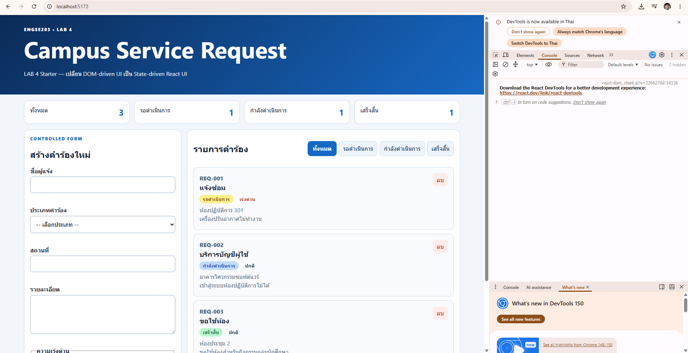
Testcase 2
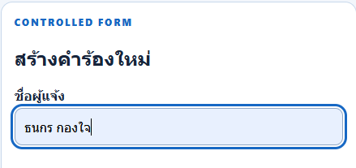
Testcase 3
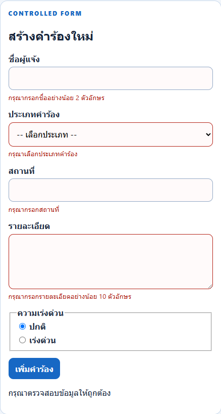
Testcase 4
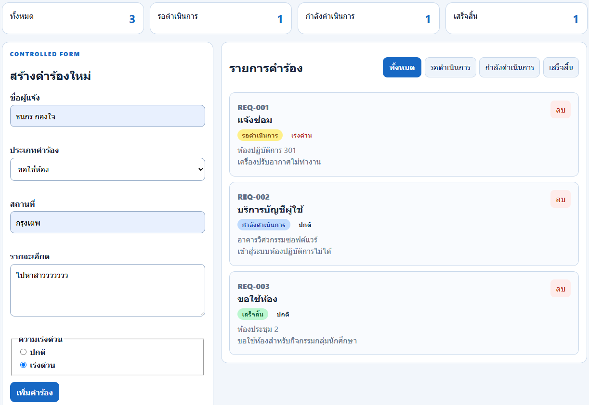
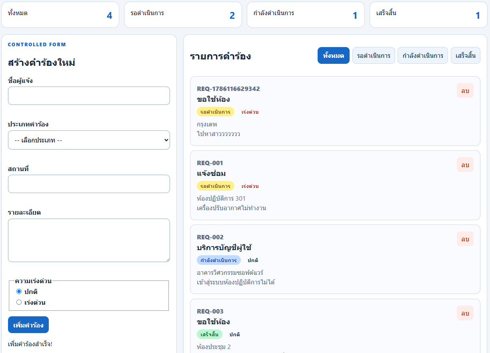
Testcase 5
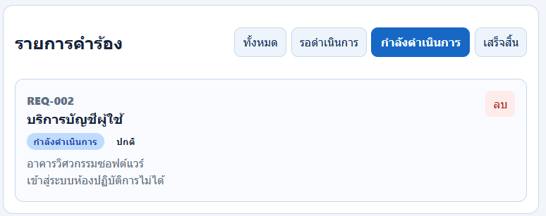
Testcase 6
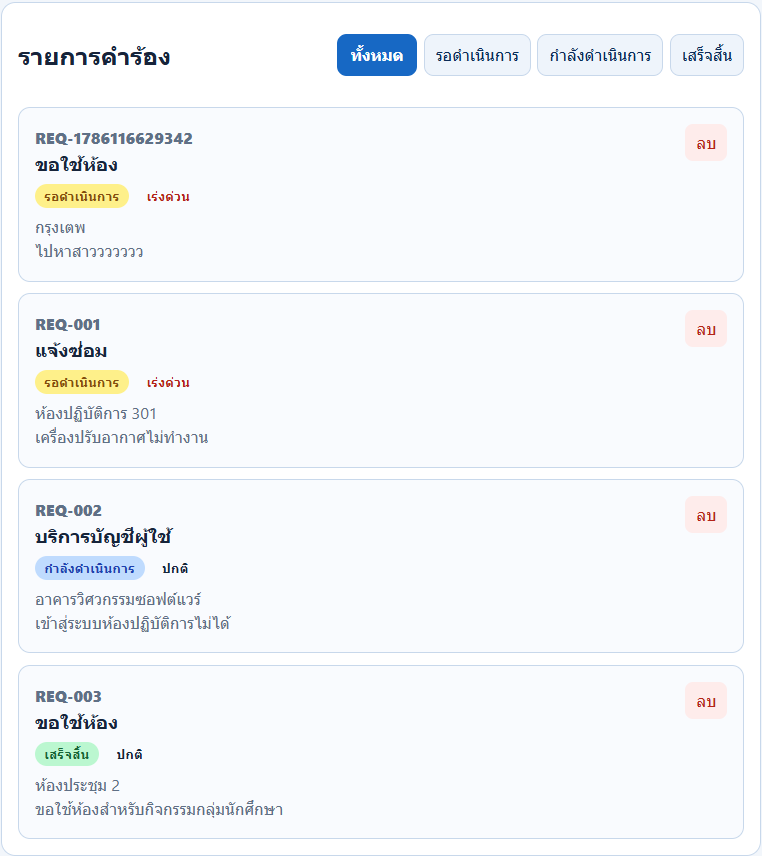
Testcase 7
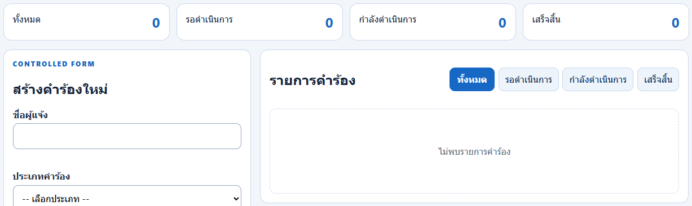
Testcase 8
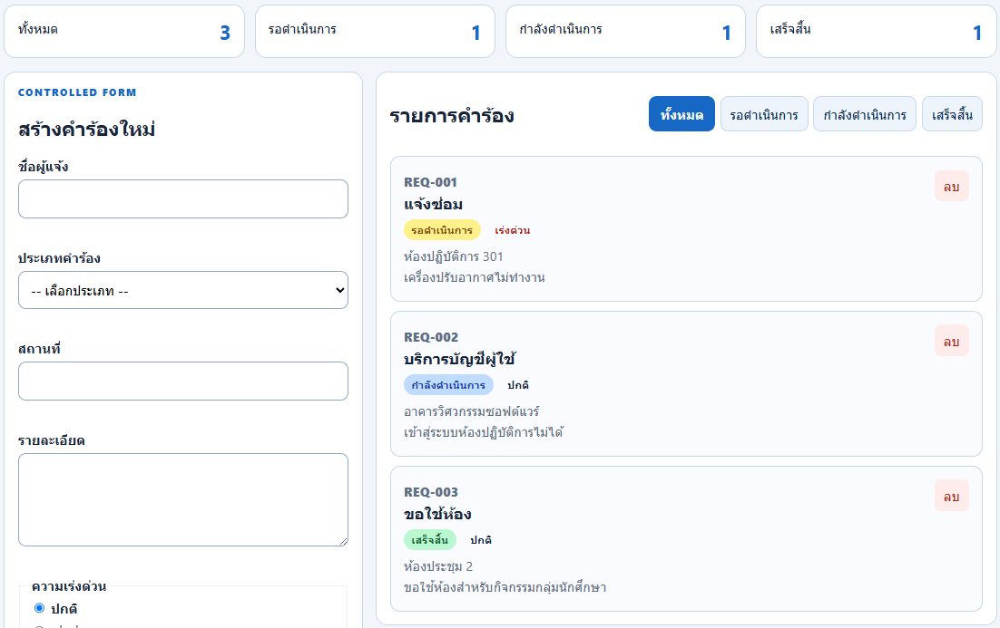
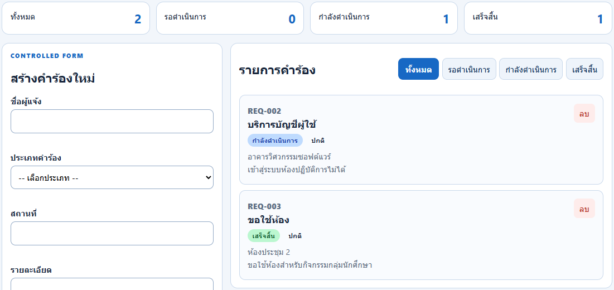
Testcase 9
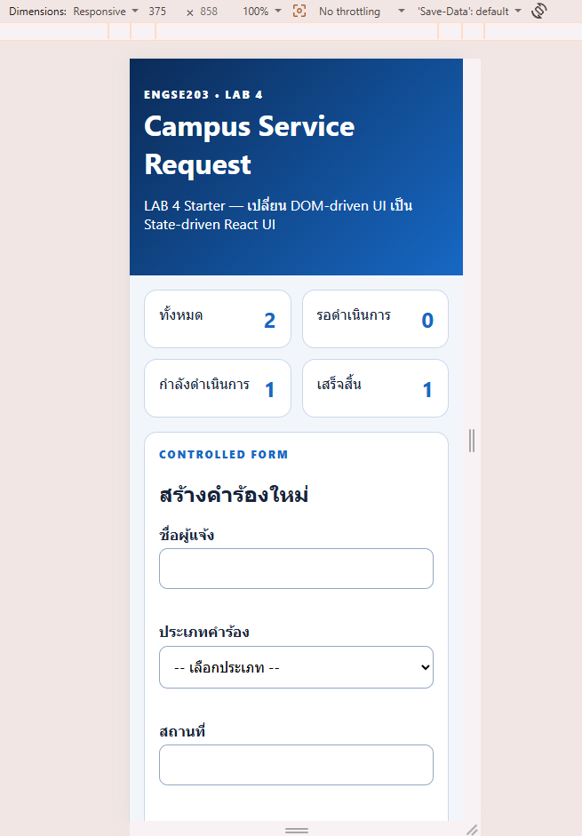
Testcase 10
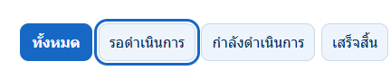
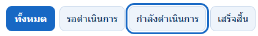
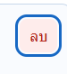
Testcase 11
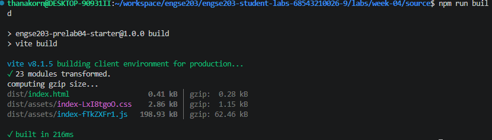
Testcase 12
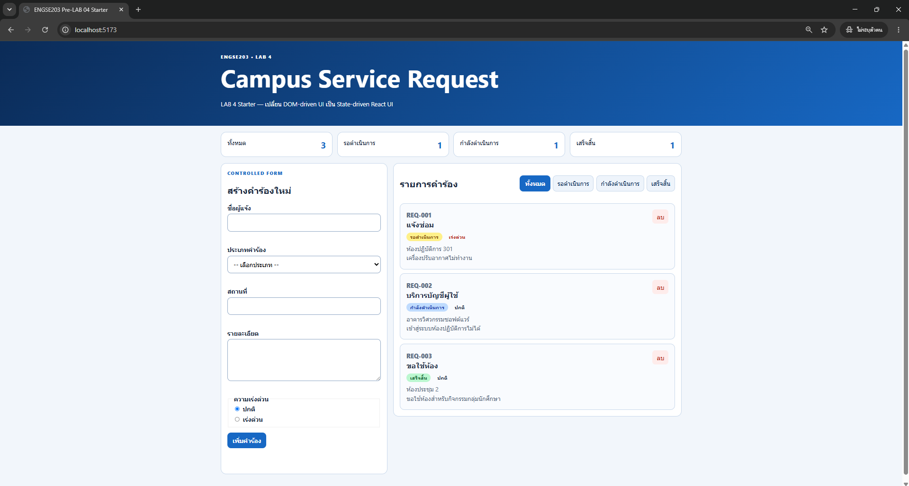

- ภาพ desktop และ mobile 375px
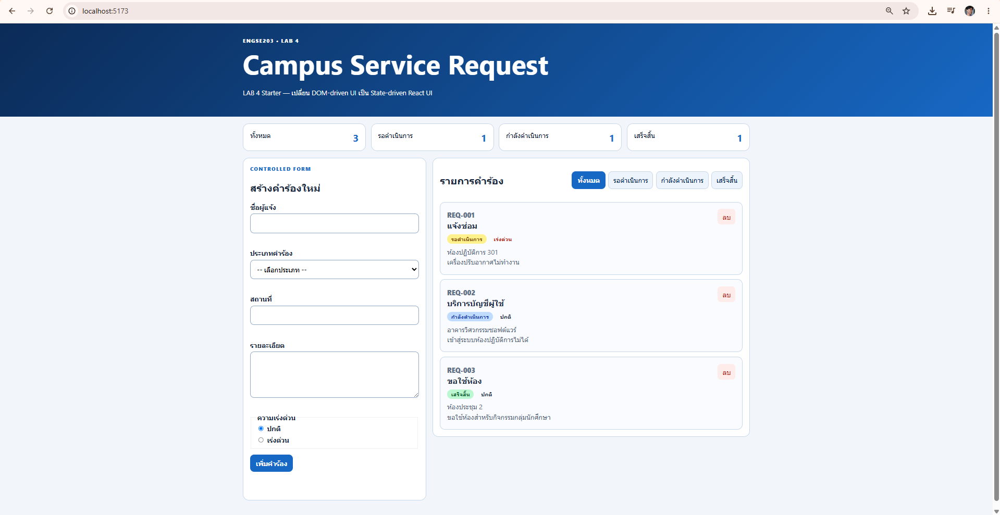
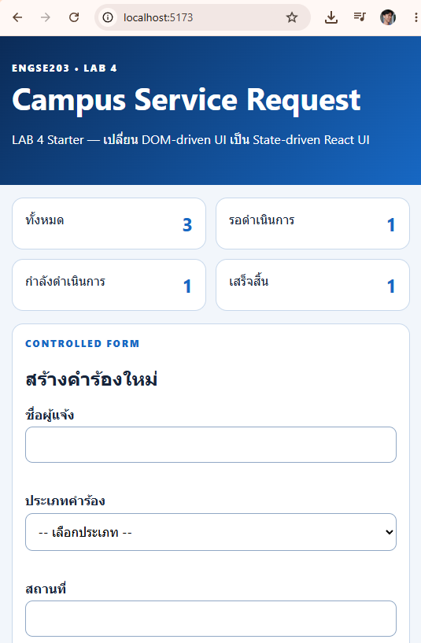
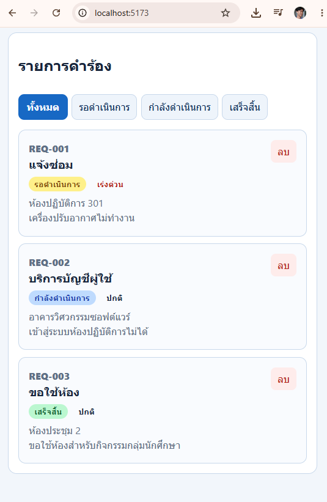
- ภาพ validation, success/empty state
- Reflection: State ownership, Props และ callback
- PR URL และ Pages URL
https://github.com/waBenford/engse203-student-labs-68543210026-9/pull/6