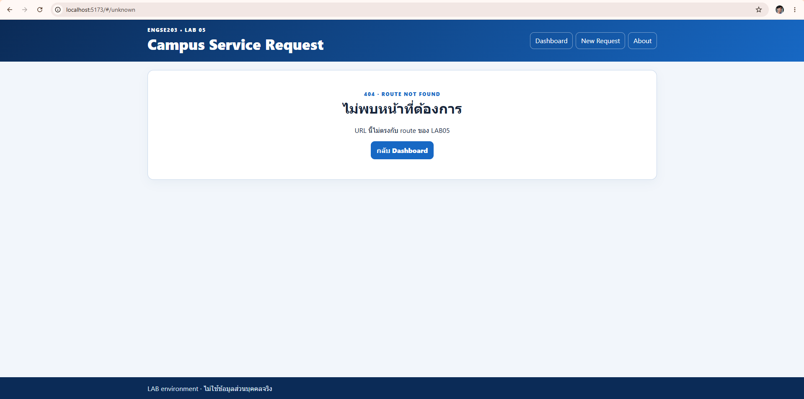
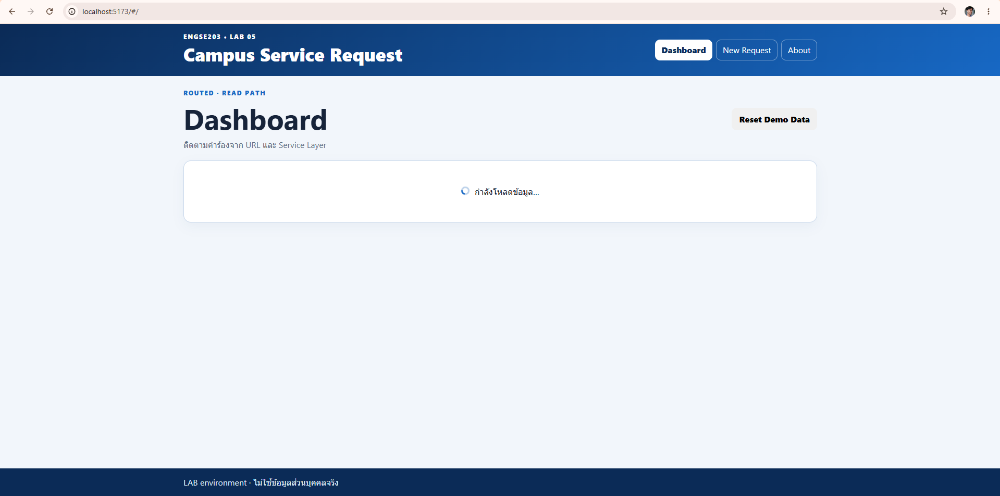
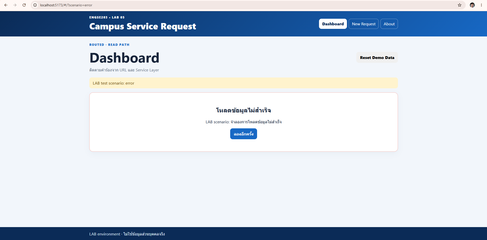
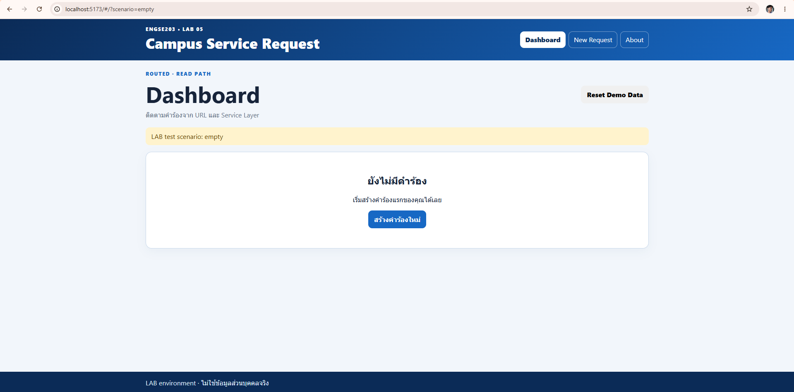
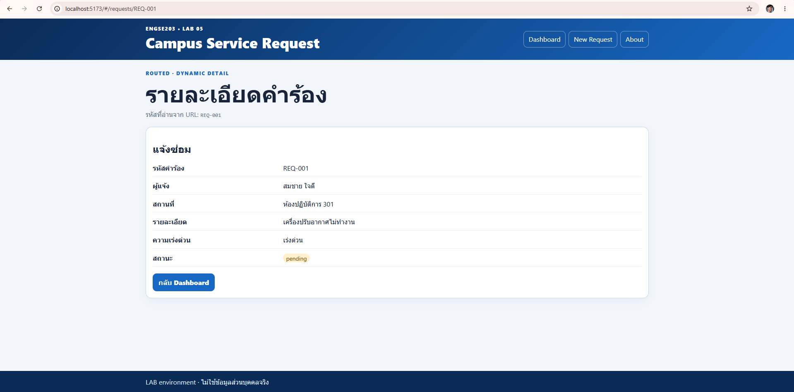
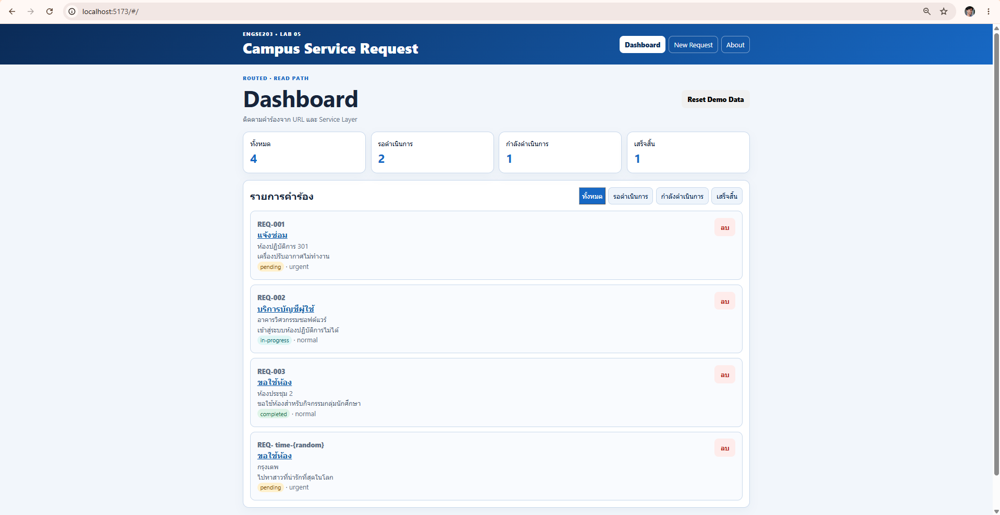
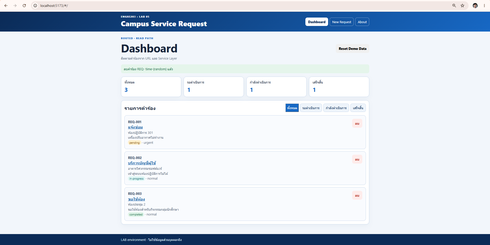
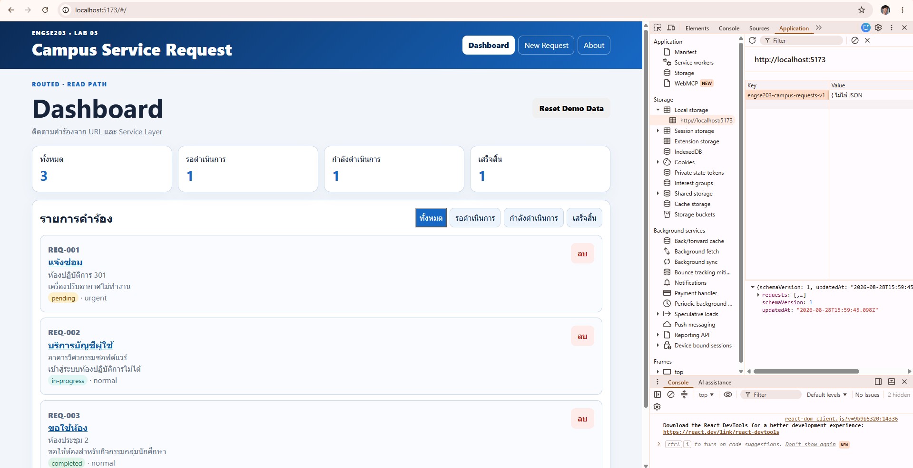
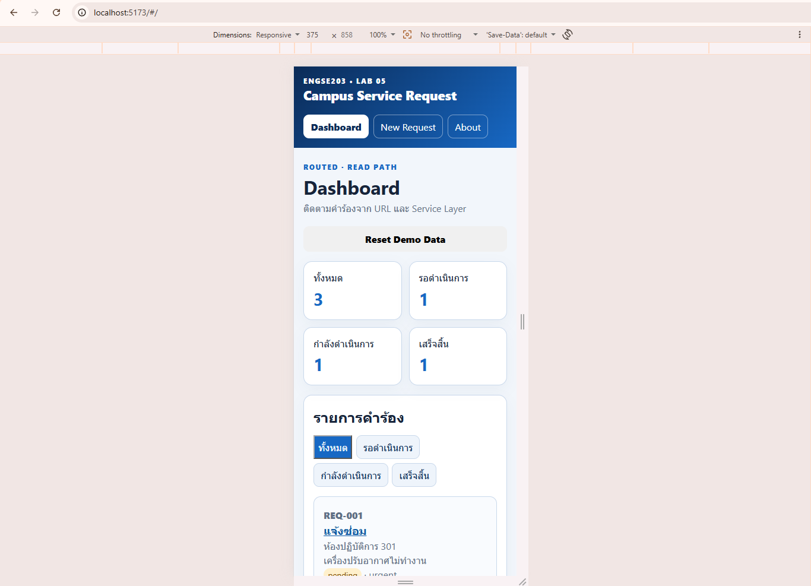

# ENGSE203 LAB05 — Student Test Report

ชื่อ–รหัส: นายธนกร กองใจ
ระบบปฏิบัติการ: windows 11
เบราว์เซอร์: chorme
Node version: v26.7.0
Branch: lab/week-05
Commit: 

กรอก Actual result จากการรันจริง ใช้ `PASS`, `FAIL` หรือ `NOT RUN` และอ้างหลักฐานแบบ relative path

| ID | ทำอะไร | ผลที่ควรได้ | ผลจริง | สถานะ | หลักฐาน |
|---|---|---|---|---|---|
| **TC-L5-01** | เปิด `#/` | หน้า Dashboard โหลดขึ้นมาพร้อมกราฟสรุปข้อมูลและตารางรายการ | เห็นหน้า Dashboard โหลดขึ้นมา มีกราฟแสดงตัวเลขสรุปและตารางรายการคำร้องครบถ้วน | PASS | |
| **TC-L5-02** | กดเมนู Dashboard → New Request → About ทีละปุ่ม · เปิด DevTools แท็บ Network ค้างไว้ | กดสลับหน้าต่าง ๆ แล้ว URL เปลี่ยน แต่ไม่มีการโหลดหน้าเว็บใหม่ (SPA) และแถบเมนูไฮไลต์ถูกต้อง | พอกดเมนูสลับไปมา หน้าเว็บเปลี่ยนทันที เช็คใน Network ไม่เจอการโหลดไฟล์ HTML ใหม่ เมนูที่กดก็เปลี่ยนสีเข้มขึ้นตรงกับหน้าปัจจุบัน | PASS | |
| **TC-L5-03** | เปิด `#/requests/new` แล้วกด `F5` | เมื่อกด F5 ในหน้าสร้างคำร้อง ระบบต้องโหลดหน้าเดิมขึ้นมา ไม่แสดง Error 404 | ลองกด F5 รีเฟรชหน้าเว็บ หน้าฟอร์มสร้างคำร้องก็ยังอยู่เหมือนเดิม ไม่หลุดไปหน้า 404 | PASS | |
| **TC-L5-06** | เปิด `#/unknown` | พิมพ์ URL มั่ว ๆ ต้องขึ้นหน้า 404 Not Found ที่มี Header, Footer และปุ่มกลับหน้าหลัก | ลองพิมพ์ URL มั่ว ๆ ระบบพาไปหน้า 404 Not Found ทันที โดยยังมีแถบ Header/Footer ของเว็บอยู่ และมีปุ่มให้กดกลับ | PASS |  |

---

## คาบ 5A · CP03 — Service และ Data Lifecycle

| ID | ทำอะไร | ผลที่ควรได้ | ผลจริง | สถานะ | หลักฐาน |
|---|---|---|---|---|---|
| **TC-L5-08** | เปิด `#/` แล้วสังเกตช่วงแรก · ถ้าถ่ายไม่ทันให้ตั้ง Network throttle เป็น Slow 3G | ต้องเห็นข้อความหรือสัญลักษณ์ Loading ก่อนที่รายการจะแสดง | ปรับเน็ตให้ช้าลง เห็นสถานะ Loading โชว์ขึ้นมาแป๊บนึงก่อนที่ตารางข้อมูลจะโหลดเสร็จ | PASS |  |
| **TC-L5-09** | เปิด `#/?scenario=error` | มีแถบเตือนสถานะ Error พร้อมข้อความที่อ่านรู้เรื่องและปุ่ม Retry โดยไม่มีโค้ด Error โผล่มา | หน้าเว็บขึ้นแถบแจ้งเตือน Error สีแดงพร้อมข้อความบอกให้ลองใหม่และปุ่ม Retry ไม่มีพวก Stack Trace หรือโค้ดรก ๆ โผล่มา | PASS |  |
| **TC-L5-10** | จากข้อ 09 กดปุ่มลองอีกครั้ง | พอกดปุ่ม Retry ระบบต้องพากลับมาหน้าหลักและแสดงข้อมูลปกติ | กดปุ่ม Retry แล้ว URL เด้งกลับมาที่ `#/` พร้อมกับโหลดรายการคำร้องขึ้นมาได้ตามปกติ | PASS | |
| **TC-L5-11** | เปิด `#/?scenario=empty` | หน้าจอแสดงข้อความบอกว่าไม่มีข้อมูล พร้อมปุ่มสำหรับไปหน้าเพิ่มคำร้อง | หน้าเว็บว่างเปล่า มีแค่ข้อความบอกว่ายังไม่มีรายการคำร้อง และมีปุ่มให้กดไปหน้าสร้างคำร้องใหม่ | PASS |  |
| **TC-L5-15** | เปลี่ยนตัวกรองครบทุกค่า — all, pending, in-progress, completed | ข้อมูลในตารางต้องเปลี่ยนตาม Filter ที่กด แต่ตัวเลขสรุปด้านบนต้องเท่าเดิม | ลองกดเปลี่ยน Filter ไปมา ตารางข้อมูลเปลี่ยนตามที่เลือกเป๊ะ แต่ตัวเลขสรุปด้านบน 4 ตัวไม่เปลี่ยนตาม | PASS | |

---

## คาบ 5A · CP05a — Dynamic Detail

| ID | ทำอะไร | ผลที่ควรได้ | ผลจริง | สถานะ | หลักฐาน |
|---|---|---|---|---|---|
| **TC-L5-04** | เปิด `#/requests/REQ-001` | แสดงหน้าข้อมูลรายละเอียดคำร้องที่ตรงกับรหัส REQ-001 | ข้อมูลของ REQ-001 โหลดขึ้นมาแสดงในหน้า Detail ได้ถูกต้องครบถ้วน | PASS |  |
| **TC-L5-05** | เปิด `#/requests/REQ-999` | แสดงหน้า Detail พร้อมข้อความบอกว่าหาข้อมูลไม่พบ และมีปุ่มกดกลับ | ระบบแสดงข้อความว่าหาคำร้องไม่เจอในหน้า Detail เลย ไม่ได้เด้งหลุดไปหน้า 404 หรือหน้า Error | PASS | |

---

## คาบ 5B · CP04a — Persistence

| ID | ทำอะไร | ผลที่ควรได้ | ผลจริง | สถานะ | หลักฐาน |
|---|---|---|---|---|---|
| **TC-L5-07** | DevTools → Application → Local Storage → ลบคีย์ `engse203-campus-requests-v1` → refresh | ข้อมูลเริ่มต้นต้องถูกสร้างขึ้นมาใหม่ใน Local Storage ทันทีที่รีเฟรชหน้าโดยไม่มีแจ้งเตือน | เข้าไปลบ Key ใน Local Storage แล้วกด F5 ข้อมูลชุด Demo ก็เด้งกลับมาสร้างใหม่เองทันที ไม่เห็นมีแจ้งเตือนอะไร | PASS | |
| **TC-L5-13** | ส่งฟอร์มโดยเว้นบางช่อง แล้วลองใส่รายละเอียดสั้นกว่า 10 ตัวอักษร | ระบบต้องแจ้งเตือนข้อผิดพลาดใต้กล่องข้อความที่กรอกไม่ครบหรือสั้นไป | ลองปล่อยช่องว่างไว้แล้วกดส่งฟอร์ม มันไม่ยอมให้ส่งและมีตัวหนังสือสีแดงเตือนใต้ช่องกรอกข้อมูลชัดเจน | PASS | |
| **TC-L5-14** | เพิ่มคำร้องที่กรอกครบ → เด้งไปหน้ารายละเอียด → กด `F5` | บันทึกข้อมูลสำเร็จ เด้งไปหน้า Detail และเมื่อรีเฟรชข้อมูลนั้นต้องยังอยู่ | กรอกข้อมูลครบแล้วกดส่ง ระบบพาไปหน้า Detail ของคำร้องใหม่ พอกด F5 รีเฟรช ข้อมูลก็ยังอยู่ไม่หายไปไหน | PASS |  |
| **TC-L5-16** | ลบคำร้องที่เพิ่งเพิ่ม → กด `F5` | รายการคำร้องที่ลบต้องหายไปจากตารางทันที และรีเฟรชก็ต้องไม่กลับมา | กดปุ่มลบคำร้องปุ๊บ ข้อมูลหายไปจากตารางทันที ลองกด F5 ข้อมูลที่ลบไปก็ไม่โผล่กลับมาแล้ว | PASS |  |
| **TC-L5-17** | กดปุ่ม Reset Demo Data → ยืนยัน | ข้อมูลทั้งหมดถูกรีเซ็ตกลับเป็นค่าเริ่มต้น และ Filter กลับไปอยู่ที่ All | กดปุ่มล้างข้อมูล Demo ข้อมูลเก่าหายไปหมดแล้วกลับมาเป็นชุดเริ่มต้น Filter ก็กลับมาเลือก All อัตโนมัติ | PASS | |

---

## คาบ 5B · CP04b — Recovery

| ID | ทำอะไร | ผลที่ควรได้ | ผลจริง | สถานะ | หลักฐาน |
|---|---|---|---|---|---|
| **TC-L5-18a** | ใน Local Storage วางค่า `{ ไม่ใช่ JSON` ทับคีย์ LAB05 → refresh | ระบบดักจับข้อมูล Local Storage ที่พังได้ ล้างทิ้ง และสร้างใหม่พร้อมขึ้น Toast แจ้งเตือน | ลองใส่ค่าแปลก ๆ ให้ JSON พัง พอกดรีเฟรช ระบบเคลียร์ทิ้งแล้วสร้างใหม่ให้เลย พร้อมขึ้น Toast แจ้งเตือนมุมจอ หน้าเว็บไม่ขาว | PASS |  |
| **TC-L5-18b** | วางค่า `{"schemaVersion":99,"requests":[]}` → refresh | ระบบเช็ค Schema Version ถ้าไม่ตรงให้สร้างข้อมูลใหม่ทันที | เปลี่ยนเลข Schema Version พอกดรีเฟรช ระบบก็รู้ว่าเลขไม่ตรง เลยล้างทิ้งแล้วกู้ข้อมูลชุด Demo กลับมาให้ | PASS | |
| **TC-L5-18c** | วาง envelope ที่มีคำร้อง `id` ซ้ำกัน 2 รายการ → refresh | ดักจับข้อมูล ID ที่ซ้ำกันได้ และรีเซ็ตข้อมูลใหม่ | ก๊อปข้อมูลที่มี ID ซ้ำกันไปใส่ พอกด F5 ระบบเช็คเจอว่าข้อมูลพัง เลยเคลียร์แล้วกู้ข้อมูล Demo คืนมาให้ใหม่ | PASS | |

---

## คาบ 5B · CP05b — Regression จาก Week 04

| ID | ทำอะไร | ผลที่ควรได้ | ผลจริง | สถานะ | หลักฐาน |
|---|---|---|---|---|---|
| **TC-L5-19** | เพิ่มและลบคำร้องหลายรอบ แล้วเทียบตัวเลขในแผงสรุปกับจำนวนรายการที่นับด้วยตา | จำนวนรายการในตารางต้องตรงกับตัวเลขบนแผงสรุปผลทุกครั้งที่มีการเปลี่ยนข้อมูล | ลองเพิ่มคำร้องใหม่และลบของเก่าทิ้ง นั่งนับแถวในตารางเทียบกับตัวเลขในกราฟสรุปด้านบน ตรงกันเป๊ะทุกรอบ | PASS | |


---

## คาบ 5B · CP06 — Verify และ Delivery

| ID | ทำอะไร | ผลที่ควรได้ | ผลจริง | สถานะ | หลักฐาน |
|---|---|---|---|---|---|
| **TC-L5-20** | DevTools → Toggle device toolbar → ตั้งความกว้าง 375px → เปิดครบทุกหน้า | หน้าเว็บไม่พังเมื่อเปิดด้วยขนาดจอ 375px ข้อความและปุ่มต้องแสดงได้พอดี | ปรับขนาดจอเป็น 375px ลองเปิดดูทุกหน้า ไม่มีส่วนไหนล้นจอจนต้องเลื่อนซ้ายขวา ปุ่มกดได้ปกติ ข้อความไม่โดนตัด | PASS |  |
| **TC-L5-21** | วางเมาส์ไว้ข้าง ๆ ใช้ `Tab` `Shift+Tab` `Enter` `Space` เท่านั้น | สามารถใช้งานหน้าเว็บได้ด้วยคีย์บอร์ดทั้งหมด และมีไฮไลต์บอกตำแหน่ง | เอามือออกจากเมาส์แล้วกด Tab เลื่อนไปมา สามารถกดปุ่มและพิมพ์แบบฟอร์มได้หมด มีกรอบไฮไลต์บอกชัดเจนว่ากำลังเลือกตรงไหน | PASS | |
| **TC-L5-12** | `npm run check` | สคริปต์ตรวจสอบผ่านทุกข้อ | รันสคริปต์ `npm run check` ในเทอร์มินัล ขึ้นตัวหนังสือสีเขียวผ่านหมด 133/133 ไม่มี Error | PASS | 133/133 |
| **TC-L5-22** | `npm run build` แล้ว `npm run preview` | รันคำสั่ง build และ preview ได้โดยไม่มี Error | พิมพ์คำสั่ง `npm run build` สำเร็จเรียบร้อย พอลอง `npm run preview` ก็เปิดเว็บดูได้ รีเฟรชก็ไม่พัง | PASS | |
| **TC-L5-23** | เปิด GitHub Pages **ในหน้าต่างส่วนตัว** แล้ว refresh ที่ URL ที่มี `#` | หน้าเว็บเปิดใช้งานผ่านโหมดไม่ระบุตัวตน (Incognito) ได้ปกติ | ก๊อป URL ไปเปิดในหน้าต่าง Incognito เว็บโหลดขึ้นปกติเหมือนคนเข้ามาใหม่ ลองรีเฟรชหน้าที่มี `#` ก็ไม่เจอ 404 | PASS | `images/pages-incognito.png` |
| **TC-L5-24** | เปิด Pull Request และติด tag `lab-05-submission-v1` | สามารถสร้าง Pull Request และ Tag เวอร์ชั่นส่งงานได้สำเร็จ | ทำการ Push Code ขึ้นไป เปิด Pull Request เข้า main และติด Tag ส่งงานบน GitHub สำเร็จเรียบร้อย | PASS | PR URL |

---

## สรุปผล

| | จำนวน |
|---|---|
| PASS | 24 |
| FAIL | 0 |
| NOT RUN | 0 |
| **รวม** | **24** |

**รายการที่ไม่ผ่าน และสิ่งที่ทำเพื่อแก้**

-

-

-

**สิ่งที่ยังแก้ไม่ได้ และเหตุผล** *(เขียนตามจริง — การยอมรับว่ายังไม่เสร็จดีกว่าการเขียนว่าเสร็จ)*

-

-

---

## ภาคผนวก · ค่าสำหรับทดสอบ TC-L5-18c

คัดลอกไปวางใน Local Storage เพื่อจำลองข้อมูลที่มี `id` ซ้ำ

```json
{"schemaVersion":1,"updatedAt":"2026-08-13T00:00:00.000Z","requests":[
{"id":"REQ-001","requesterName":"ทดสอบ หนึ่ง","requestType":"แจ้งซ่อม","location":"A","details":"รายละเอียดยาวพอสมควร","priority":"normal","status":"pending"},
{"id":"REQ-001","requesterName":"ทดสอบ สอง","requestType":"แจ้งซ่อม","location":"B","details":"รายละเอียดยาวพอสมควร","priority":"normal","status":"pending"}]}