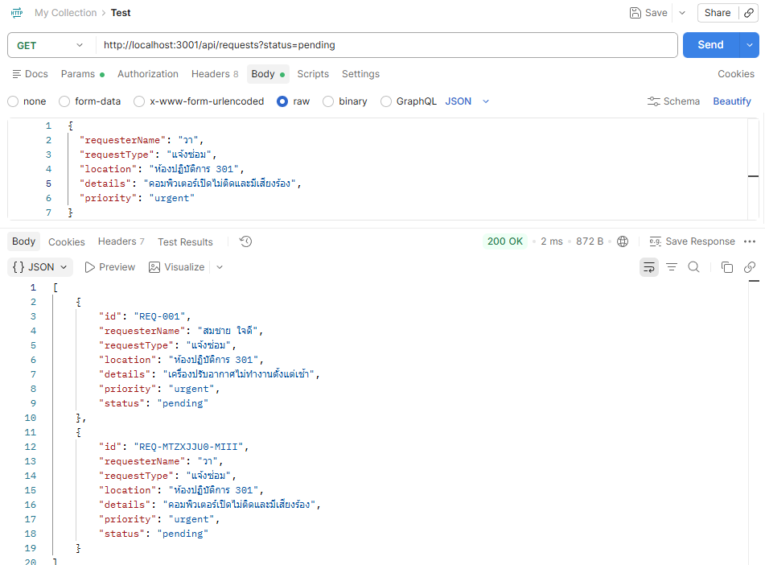
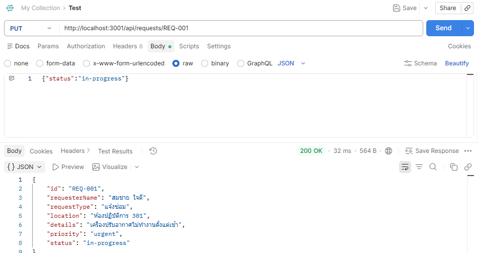
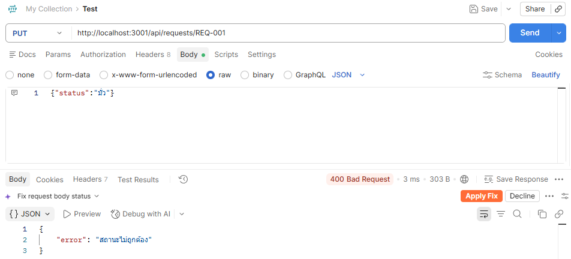
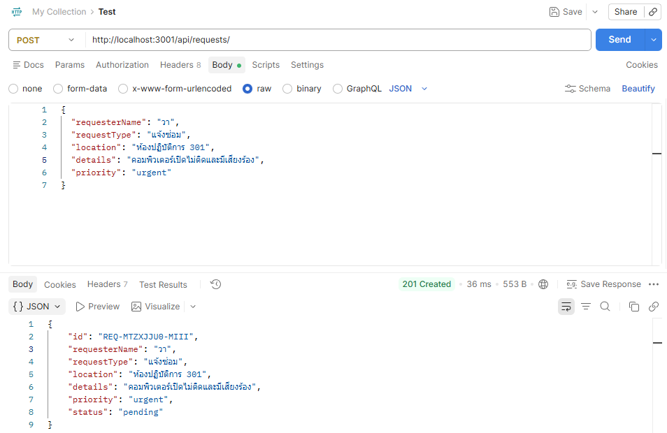
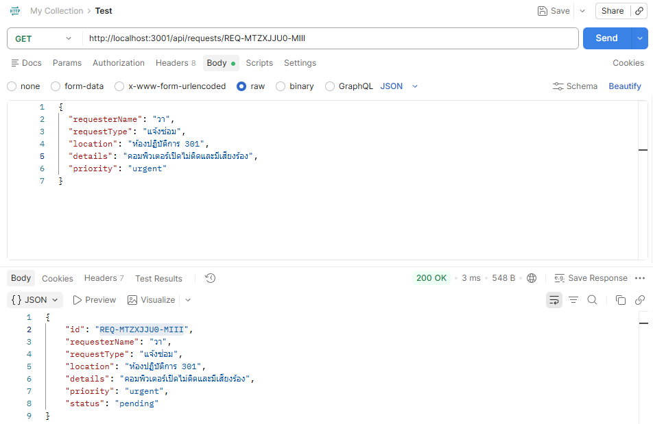
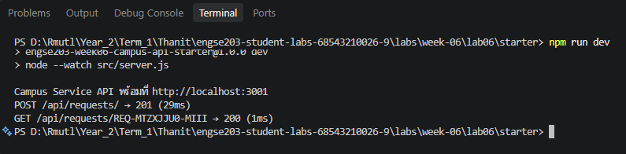
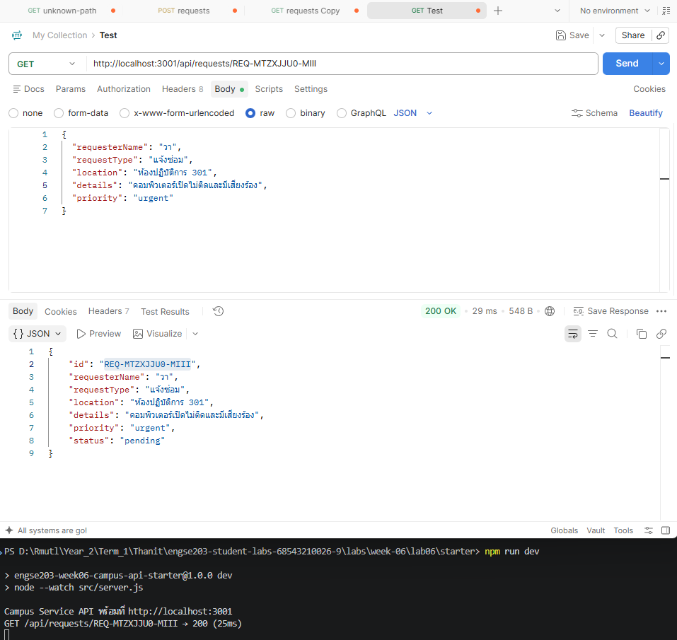

# API_TEST — LAB 06

**ชื่อ–รหัส:** ธนกร กองใจ 68543210026-9 **วันที่ทดสอบ:** 13/09/2026

> บันทึก **ผลจริง** ที่เห็น ไม่ใช่ผลที่ควรได้ · ถ้าไม่ผ่านให้เขียนว่าไม่ผ่าน

| # | Method | Path | ส่งอะไร | status ที่ควรได้ | status ที่ได้จริง | ผ่าน |
|---|---|---|---|---|---|---|
| 1 | GET | `/` | — | 200 | 200OK | ✓ |
| 2 | GET | `/api/requests` | — | 200 | 200OK | ✓ |
| 3 | GET | `/api/requests/REQ-001` | — | 200 | 200OK | ✓ |
| 4 | GET | `/api/requests/REQ-999` | — | 404 | 404Not Found | ✓ |
| 5 | POST | `/api/requests` | ข้อมูลครบถูกต้อง | 201 | 201Created | ✓ |
| 6 | POST | `/api/requests` | `{"requesterName":"x"}` | 400 | 400Bad Request | ✓ |
| 7 | DELETE | `/api/requests/REQ-003` | — | 204 | 204No Content | ✓ |
| 8 | DELETE | `/api/requests/REQ-999` | — | 404 | 404Not Found | ✓ |
| 9 | GET | `/api/unknown` | — | 404 | 404Not Found | ✓ |

## ⭐ Challenge (ถ้าทำ)

| # | Method | Path | status ที่ควรได้ | ที่ได้จริง | ผ่าน |
|---|---|---|---|---|---|
| 10 | GET | `/api/requests?status=pending` | 200 (กรองแล้ว) |  | ✓ |
| 11 | PUT | `/api/requests/REQ-001` + `{"status":"in-progress"}` | 200 |  | ✓ |
| 12 | PUT | `/api/requests/REQ-001` + `{"status":"มั่ว"}` | 400 |  | ✓ |

## ทดสอบว่าข้อมูลอยู่ถาวร (CP08)

| ขั้น | ทำอะไร | ผลที่เห็น |
|---|---|---|
| 1 | POST เพิ่มคำร้องใหม่ |  |
| 2 | GET ดูรายการ — เห็นคำร้องใหม่ไหม |  |
| 3 | Ctrl+C ปิดเซิร์ฟเวอร์ แล้วเปิดใหม่ |  |
| 4 | GET ดูรายการอีกครั้ง — คำร้องยังอยู่ไหม |  |

## สรุปผล

- ผ่าน 9 / 9 (+ Challenge 3 / 3)
- รายการที่ไม่ผ่านและสาเหตุ:

## Screenshot ที่แนบ

- [x] `images/postman-get-200.png`
- [x] `images/postman-post-201.png`
- [x] `images/terminal-logger.png`
