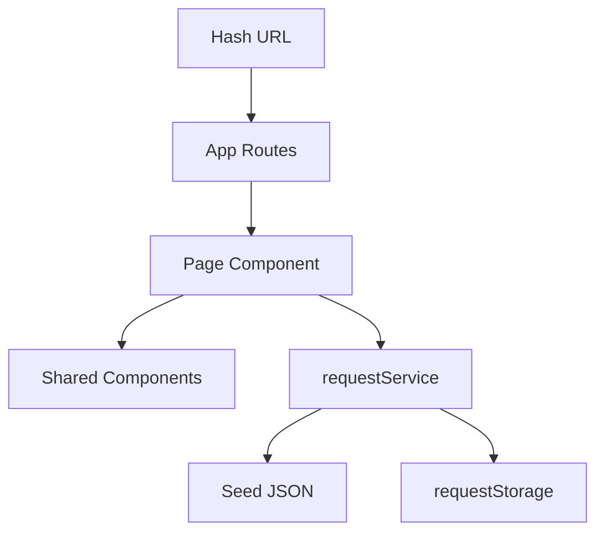

# ENGSE203 LAB05 — Campus Service Request

Reference implementation สำหรับ Phase W5-D (Instructor Private)

## Run

```bash
npm ci
npm run dev
npm run check
npm run build
npm run preview
```

## Architecture



- `App.jsx` กำหนด route matrix
- `pages/` เป็นเจ้าของ route-specific state และ lifecycle
- `components/` รับข้อมูลและ handler ผ่าน props
- `requestService.js` เป็น data-access boundary ของ UI
- `requestStorage.js` เป็นไฟล์เดียวที่ใช้ `localStorage`

## Effect reasoning

Dashboard Effect ขึ้นกับ `scenario` และ `reloadKey` เพราะทั้งสองค่าเปลี่ยนชุดข้อมูลที่ต้อง synchronize จาก Service ส่วน summary และ filtered list เป็น derived data ระหว่าง render จึงไม่อยู่ใน Effect มี `ignore` cleanup guard เพื่อป้องกันผล async เก่ามาเขียน state หลัง route/scenario เปลี่ยน

## Privacy

ใช้ข้อมูลสาธิตเท่านั้น ห้ามบันทึก token, password, secret หรือข้อมูลส่วนบุคคลจริงใน `localStorage` หรือหลักฐานภาพ
