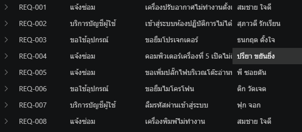
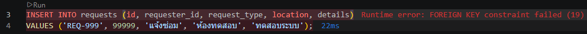
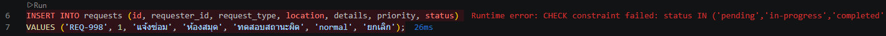
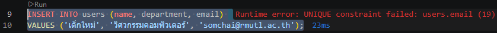
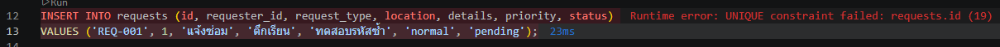
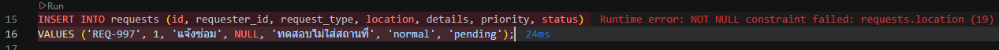

# DATA_MODEL.md — การออกแบบฐานข้อมูล Campus Service Request

---

## 1. ภาพรวม

```text
[ users ]                           [ requests ]
+---------------+                   +--------------------+
| id (PK)       | 1--------------<N | id (PK)            |
| name          |                   | requester_id (FK)  |
| department    |                   | request_type       |
| email         |                   | location           |
+---------------+                   | details            |
                                    | priority           |
                                    | status             |
                                    | created_at         |
                                    +--------------------+
```
เป็นความสัมพันธ์แบบ หนึ่งต่อหลาย (One-to-Many หรือ 1:N)
ผู้ใช้งาน 1 คน สามารถแจ้งคำร้อง ได้หลายรายการ
---

## 2. ทำไมต้องแยกเป็น 2 ตาราง

**"ถ้าสมชายเปลี่ยนชื่อ ต้องแก้กี่ที่"**
ตอน Week 06–07 การเก็บ requesterName ไว้ในทุกคำร้องทำให้เกิดข้อมูลซ้ำซ้อน หากสมชายมีการเปลี่ยนชื่อ เราจะต้องไล่แก้ไขข้อมูลในทุกๆ คำร้องที่สมชายเคยสร้างไว้
แต่เมื่อแยกเป็น 2 ตาราง จะช่วยแก้ปัญหานี้ได้ หากสมชายเปลี่ยนชื่อ เราสามารถใช้คำสั่ง UPDATE แก้ไขที่ตาราง users เพียงเรคคอร์ดเดียว ข้อมูลคำร้องทั้งหมดที่ผูกกับ requester_id ของสมชายก็จะอ้างอิงชื่อใหม่ที่ถูกต้องตามไปด้วย
---

## 3. รายละเอียดตาราง

| ตาราง | คอลัมน์ | ชนิด | ข้อกำหนด | เหตุผล |
| :--- | :--- | :--- | :--- | :--- |
| **users** | `id` | INTEGER | PK AUTOINCREMENT | เก็บเป็นตัวเลขเพื่อรันลำดับอัตโนมัติ เป็นคีย์หลักเพื่อใช้อ้างอิงตัวบุคคล |
| | `name` | TEXT | NOT NULL | เก็บเป็นข้อความ จำเป็นต้องมีเสมอเพื่อระบุตัวตน ห้ามเป็นค่าว่าง |
| | `department` | TEXT | NOT NULL | เก็บเป็นข้อความ จำเป็นต้องระบุสังกัดเพื่อใช้ติดต่อ ห้ามเป็นค่าว่าง |
| | `email` | TEXT | NOT NULL UNIQUE | เก็บเป็นข้อความ จำเป็นต้องใช้ติดต่อ ห้ามเป็นค่าว่าง และห้ามซ้ำกับผู้ใช้อื่น |
| **requests** | `id` | TEXT | PRIMARY KEY | เก็บเป็นข้อความเพื่อให้ตั้งรหัสสื่อความหมายได้ (REQ-001) เป็นคีย์หลักอ้างอิงคำร้อง |
| | `requester_id` | INTEGER | NOT NULL (FK) | เก็บเป็นตัวเลขเพื่อเชื่อมกับรหัสผู้ใช้ จำเป็นต้องมีเพื่อระบุว่าใครแจ้ง ห้ามเป็นค่าว่าง |
| | `request_type` | TEXT | NOT NULL, CHECK | เก็บเป็นข้อความ ห้ามเป็นค่าว่าง และจำกัดเฉพาะคำที่กำหนดเพื่อป้องกันสะกดผิด |
| | `location` | TEXT | NOT NULL | เก็บเป็นข้อความ จำเป็นต้องระบุสถานที่เพื่อให้ไปทำงานถูกจุด ห้ามเป็นค่าว่าง |
| | `details` | TEXT | NOT NULL | เก็บเป็นข้อความ จำเป็นต้องอธิบายปัญหาหรืออาการ ห้ามเป็นค่าว่าง |
| | `priority` | TEXT | NOT NULL, DEFAULT, CHECK | เก็บเป็นข้อความ ห้ามเป็นค่าว่าง มีค่าเริ่มต้นเป็น normal และจำกัดเฉพาะคำที่กำหนด |
| | `status` | TEXT | NOT NULL, DEFAULT, CHECK | เก็บเป็นข้อความ ห้ามเป็นค่าว่าง มีค่าเริ่มต้นเป็น pending และจำกัดเฉพาะคำที่กำหนด |
| | `created_at` | TEXT | NOT NULL, DEFAULT | เก็บเป็นข้อความ ห้ามเป็นค่าว่าง และใช้ฟังก์ชันประทับเวลาปัจจุบันให้อัตโนมัติ |

---

## 4. เหตุผลของการเลือกชนิดและข้อกำหนด

ทำไม `users.id` กับ `requests.id` ใช้ชนิดต่างกัน
* users.id ใช้ INTEGER เพื่อให้ระบบรันตัวเลขอัตโนมัติ (AUTOINCREMENT) เหมาะกับการเป็นรหัสอ้างอิงภายในที่ระบบจัดการเอง แต่ requests.id ใช้ TEXT เพราะต้องการให้เป็นรหัสที่มนุษย์อ่านเข้าใจและสื่อความหมายได้ (เช่น 'REQ-001') เพื่อให้ผู้ใช้จดจำและนำไปใช้ติดตามสถานะคำร้องได้ง่าย

ทำไมต้องมี `CHECK constraint` ทั้งที่ `API` ก็ตรวจข้อมูลอยู่แล้ว
* เพื่อรักษาความถูกต้องของข้อมูล (Data Integrity) ในระดับฐานข้อมูลซึ่งเป็นปราการด่านสุดท้าย หากมีการเพิ่มข้อมูลโดยตรงผ่านโปรแกรมจัดการฐานข้อมูล (เช่น รันคำสั่ง SQL เองใน VS Code) หรือตัว API เกิดข้อผิดพลาด CHECK constraint จะช่วยการันตีว่าข้อมูลที่ไม่ตรงเงื่อนไขจะไม่ถูกบันทึกลงฐานข้อมูลเด็ดขาด
---

## 5. ตัวอย่างการใช้ JOIN

```sql
SELECT requests.id, requests.request_type, requests.details, users.name 
FROM requests 
JOIN users ON requests.requester_id = users.id;
```
ผลลัพธ์


---

## 6. ข้อสังเกตสำหรับสัปดาห์ที่ 10

```text
-- ผลลัพธ์จาก SQL JOIN (Week 09)
REQ-001 | สมชาย ใจดี | pending

-- ข้อมูล JSON ที่ API ส่งให้ React (Week 07)
{ "id": "REQ-001", "requesterName": "สมชาย ใจดี", "status": "pending" }
```

ข้อมูลที่ได้จากการใช้คำสั่ง JOIN หน้าตาเหมือนกับ JSON ที่เราใช้ตอน Week 07 คือได้รายละเอียดคำร้องกับชื่อคนแจ้งรวมมาให้ครบจบในที่เดียว

สิ่งที่เห็น:
* การใช้ฐานข้อมูล (SQL) ช่วยให้เราทำงานสบายขึ้นมาก มันสามารถ "ประกอบร่าง"  ข้อมูลที่อยู่คนละตารางให้เราได้ด้วยคำสั่งเดียว ทำให้ฝั่ง API แค่คิวรีข้อมูลเสร็จก็ส่งต่อให้ React เอาไปแสดงผลได้เลย ไม่ต้องมาเหนื่อยเขียนโค้ดวนลูปจับคู่ข้อมูลเองเหมือนตอนที่ใช้ไฟล์ JSON

## ผลการทดสอบ Constraint

### ① Foreign Key

**คำสั่งที่ลอง**

```sql
INSERT INTO requests (id, requester_id, request_type, location, details)
VALUES ('REQ-999', 99999, 'แจ้งซ่อม', 'ห้องทดสอบ', 'ทดสอบระบบ');
```

**ผลที่ได้** `FOREIGN KEY constraint failed` ✓ ถูกปฏิเสธตามที่ควร



### ② CHECK constraint

**คำสั่งที่ลอง**

```sql
INSERT INTO requests (id, requester_id, request_type, location, details, priority, status) 
VALUES ('REQ-998', 1, 'แจ้งซ่อม', 'ห้องสมุด', 'ทดสอบสถานะผิด', 'normal', 'ยกเลิก');
```

**ผลที่ได้** `CHECK constraint failed` ✓ เพราะระบบล็อกให้รับแค่ pending, in-progress, completed



### ③ UNIQUE constraint

**คำสั่งที่ลอง**

```sql
INSERT INTO users (name, department, email) 
VALUES ('เด็กใหม่', 'วิศวกรรมคอมพิวเตอร์', 'somchai@rmutl.ac.th');
```

**ผลที่ได้** `UNIQUE constraint failed: users.email` ✓ เพราะอีเมล somchai มีในระบบแล้ว



### ④ UNIQUE constraint

**คำสั่งที่ลอง**

```sql
INSERT INTO requests (id, requester_id, request_type, location, details, priority, status) 
VALUES ('REQ-001', 1, 'แจ้งซ่อม', 'ตึกเรียน', 'ทดสอบรหัสซ้ำ', 'normal', 'pending');
```

**ผลที่ได้** `UNIQUE constraint failed: requests.id` ✓ เพราะ REQ-001 ถูกสร้างไปแล้ว



### ⑤ NOT NULL constraint

**คำสั่งที่ลอง**

```sql
INSERT INTO requests (id, requester_id, request_type, location, details, priority, status) 
VALUES ('REQ-997', 1, 'แจ้งซ่อม', NULL, 'ทดสอบไม่ใส่สถานที่', 'normal', 'pending');
```

**ผลที่ได้** `NOT NULL constraint failed: requests.location` ✓ เพราะคอลัมน์นี้ห้ามเป็นค่าว่างหรือ NULL

