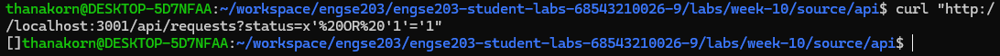
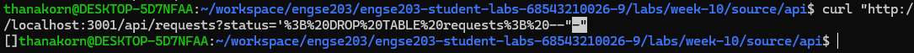
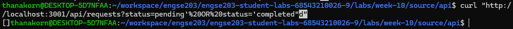
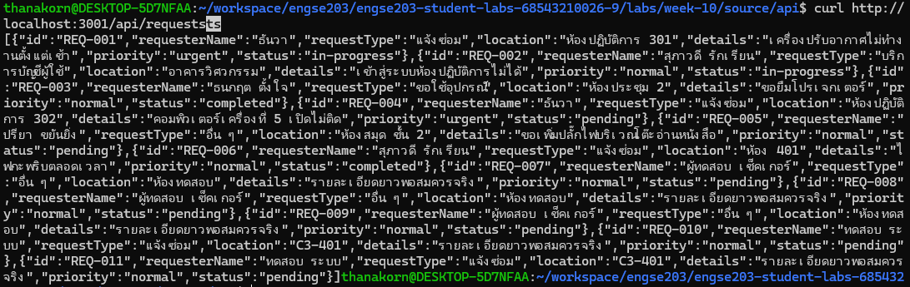

### ① เงื่อนไขที่เป็นจริงเสมอ

**ยิง** `GET /api/requests?status=x' OR '1'='1`
**ผลที่ได้** `[]` (0 รายการ) ✓ ถูกป้องกัน
**เพราะ** ใช้ parameterized query — ค่าถูกตีความเป็นข้อความ ไม่ใช่คำสั่ง

#### หลักฐาน

### ② พยายามลบตาราง

**ยิง** `GET /api/requests?status='; DROP TABLE requests; --`
**ผลที่ได้** `[]` จำนวน 0 รายการ และ API ยังทำงานตามปกติ
**เพราะ** คำสั่ง `DROP TABLE requests` ถูกมองเป็นค่า status ไม่ได้ถูกนำไปประมวลผลเป็นคำสั่ง SQL

#### หลักฐาน

### ③ ต่อเงื่อนไขเพิ่ม

**ยิง** `GET /api/requests?status=pending' OR status='completed`
**ผลที่ได้** `[]` จำนวน 0 รายการ
**เพราะ** เงื่อนไข `OR status='completed'` ถูกมองเป็นส่วนหนึ่งของข้อความ status ไม่ใช่เงื่อนไข SQL

#### หลักฐาน

### ④ พิสูจน์ว่าตารางยังอยู่

#### หลักฐาน
